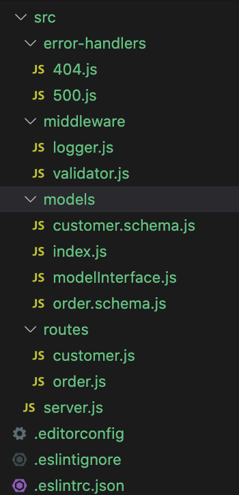

# Class 04: Relational Data Modeling

## Warmup

[Reduce Repl](https://replit.com/@rkgallaway/401d47-reduce#index.js)

## Code Review

What do we need?

#### Binary Search

[You Tube Demo](https://www.youtube.com/watch?v=7lGiPItOVCM)

what is Big O?

#### Lab-03 COde Review

- bring your questions to class!
- we will do a significant code review!

## Relational Data Modeling

Mongo was a non relational database and if a customer had multiple orders we likely saw something like this in our table:

Postgres is a relational database and gives us the opportunity to join multiple tables together

we will create relations today amongst our models

## Abstract CRUD operations from our REST method handlers

> we repeat ourselves a lot in our get all, get one, post, put and delete REST routes.  Additionally, we aren't following the single responsibility principle as well as we could be in our route handlers.  Today we will see one possible way to abstract out our crud operations and create a modelInterface to manage the crud, allowing our route handlers to handle the rest operations

## Demo Code File Scaffold (approximation)

